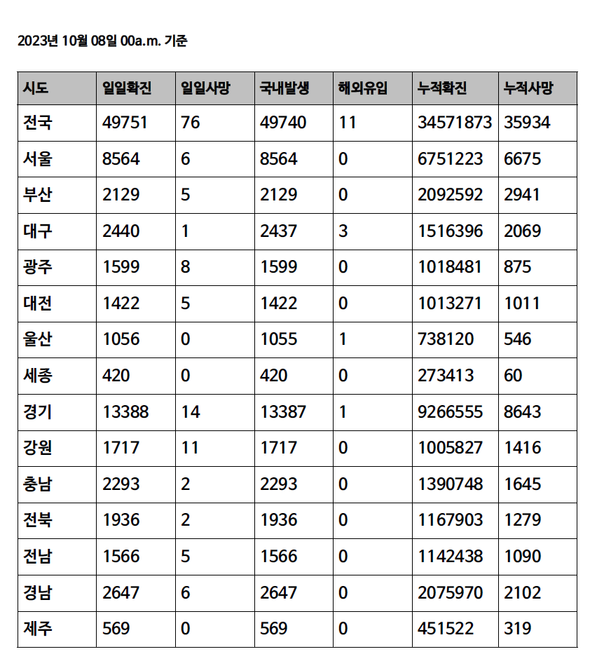
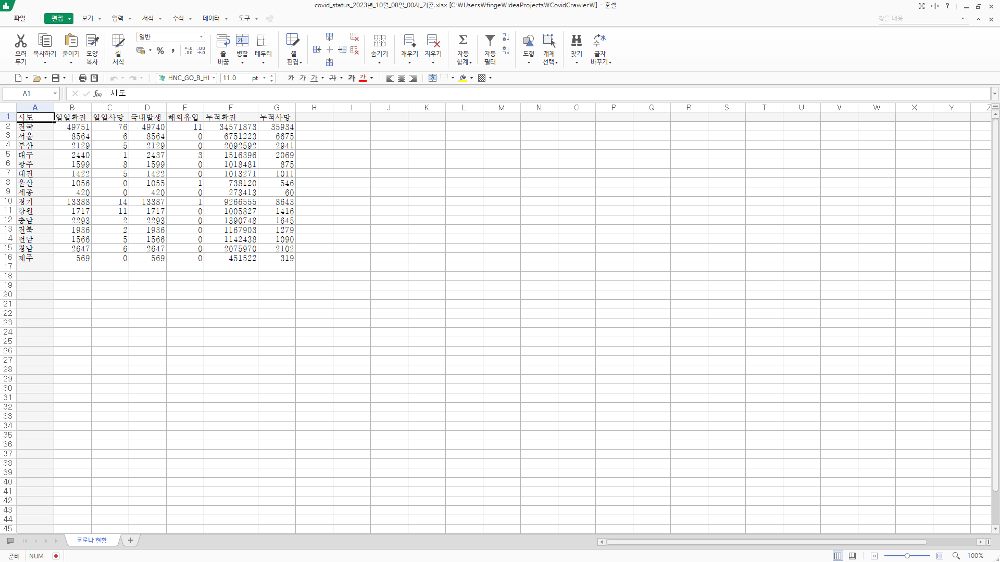

# 지역별 일일 코로나 현황 크롤러
***
## 개요

>통계청의 COVID-19 데이터를 이용해서 일일 코로나 감염자 현황을 가져오는 웹크롤러입니다.
>기존에 질병관리청에서 시도별로 올라와있던 통계 자료가 2023년 8월 31일자로 코로나19의 감염병 등급이 2급에서
>4급으로 조정되면서 코로나 상황판이 더 이상 업데이트 되지 않아 통계청에서 만든 지도 자료를 참고하여 제작하였습니다.
>통계청 지도 자료에서 일일 감염자 현황과 누적 데이터를 가져와 pdf 와 xlsx 형식으로 변환하여 저장할 수 있습니다.
>통계청 지도 자료는 아래 링크를 통해서 확인할 수 있습니다.

[코로나바이러스 감염증-19 전국 상황판](https://kosis.kr/covid/covid_index.do)
***

### 사용한 기술들
```
JDK = 11.0.18
Gradle - Groovy
itextpdf = 7.1.15
poi = 5.2.0
poi-ooxml = 5.2.0
selenium - java = 4.13.0
chrome & chromedriver (stable) = 117.0.5938.149 (win-64)
pesticide for chrome
```

***
### 구현한 기능 목록

* **동적 웹 크롤링** : selenium을 통해서 지도 클릭을 자동화하여 각 지역을 눌러서 일일 현황과 누적 현황을 받아오도록 하였습니다.
* **코로나 데이터 저장** : 변환할 때 사용할 수 있도록 받아온 자료를 지역별로 저장할 수 있는 CovidStatus 클래스를 만들었습니다.
* **pdf로 변환** : 저장된 지역별 코로나 데이터를 pdf로 변환하여 저장할 수 있습니다.
* **excel로 변환** : 저장된 지역별 코로나 데이터를 xlsx로 변환하여 저장할  수 있습니다. 


***
### TroubleShooting

&emsp;지도에 있는 각 도시별로 클릭하여야 웹페이지가 해당 도시의 데이터를 불러 오기 때문에 각 도시들을 자동으로 클릭할 수 있는 방법을 고안하였습니다. Jsoup과 유사하게 Selenium은 id, className, css selector 등을 통하여 element을 찾을 수 있습니다. Jsoup은 정적인 웹사이트를 가져올 수 있었다면 Selenium은 동적인 페이지를 마우스 클릭이나 키보드 동작을 통해서 입력을 넣고 그에 따라 바뀌는 결과값을 가지고 올 수 있습니다. 

&emsp;이를 위해서 먼저 Chrome의 개발자 도구를 통해 어떤 식으로 각 도시에 접근할 수 있는지 확인하였습니다. 이 과정을 통해서 각 도시들이 V로 시작하는 id 선택자를 가지고 있다는 것을 알게 되었고 이를 통해서 각 도시를 id를 통해 클릭할 수 있도록 하였습니다. 아래의 cityIds 배열에서 10번대 자리수는 서울, 20번대 자리수는 광역시 (세종을 포함합니다), 30번대 자리수는 각 도를 의미합니다.


```java
private static String[] cityIds = {"V11"
        , "V21", "V22", "V23", "V24", "V25", "V26", "V29"
        , "V31", "V32", "V33", "V34", "V35", "V36", "V37", "V38", "V39"};
```

&emsp;하지만 지도에서 각 행정구역을 클릭을 자동화하는 것을 구현하고 실행시켰을 때, ElementClickInterceptedException이 발생하면서 모든 구역이 정상적으로 선택되지는 않았습니다. 해당 예외는 클릭해야하는 위치에 겹쳐있는 선택자가 있거나 페이지 로딩이 정상적으로 나타나지 않았을 때 발생합니다.


이번 프로젝트에서는 인천과 같은 도시가 지도 상에서 범위가 좁고 배경의 지도 이미지와 겹쳐있어서 선택할 수 없었습니다.

```java
Point now = driver.findElement(By.id(cityId)).getLocation();
int x = now.x;
int y = now.y;
Actions step = new Actions(driver);

for (int i = now.x; i < coordinates[now][0]; i++) {
    for (int j = now.y; i < coordinates[now][1]; i++) {
        y++;
        step.moveToElement(x, y).click();
    }   
    x++;
    y = now.y;
}
```

&emsp;이에 따라서 처음에는 위의 코드와 같이 for loop을 통해서 해당 이미지 근처 픽셀을 하나씩 다 눌러보고 해당하는 도시가 나올때까지 찾으려고 하였으나 해당 행정구역을 클릭할 수 없었으며 따라서 해당 예외가 터지는 구역들은 try - catch를 통해서 결과에서 제외하였습니다.

&emsp;또한 이 방식은 for문을 x와 y 좌표를 하나씩 더해가면서 해당 픽셀을 확인했기 때문에 시간적으로 비효율적이라고 생각하였습니다. 이 프로젝트의 목표는 웹 크롤링을 이해하고 배우는 것을 목표로 하고 시작했었기 때문에 해당 예외가 발생하는 구역들은 결과에서 제외하고 나머지 구역은 결과에 추가하였습니다. 아래는 이 과정을 통해서 리팩토링한 코드입니다. 

```java
public class CovidScraper {
    for (String cityIndex : cityIds) {
        try {
            driver.findElement(By.id(cityIndex)).click();
            CovidStatus curCovidStatus = getCovidStatus(driver);
            if (curCovidStatus != null) {
                covidStatusList.add(curCovidStatus);
            }
        } catch (ElementClickInterceptedException e) {
            e.printStackTrace();
        }
    }
        for (CovidStatus cs : covidStatusList) {
        System.out.println(cs.toString());
    }
        driver.close();
        ExcelExporter.generateCovidListExcel(covidStatusList, fileName + ".xlsx");
        PdfExporter.generateCovidListPdf(covidStatusList, fileName + ".pdf", date);
}
```

> 여기서 입력값은 지도 클릭을 통해 바뀐 브라우저 상에서의 데이터이고 출력값은 getCovidStatusMethod(driver) 메서드를 통해서 가져온 결과입니다. 
> CovidStatus는 해당 시도의 일일 확진, 일일 사망, 국내 발생, 해외 유입, 누적 확진, 누적 사망 수를 포함하고 있습니다.

## 결과 (실행 영상 포함)
***
### 결과물 미리보기
#### PDF

#### Excel

### 실행 영상

> 더 화질이 높은 실행 영상은 [여기서](https://drive.google.com/file/d/1WIsoNNQx17GBcD_BLozoNpW_rVTYc6US/view?usp=drive_link) 확인하실 수 있습니다.
